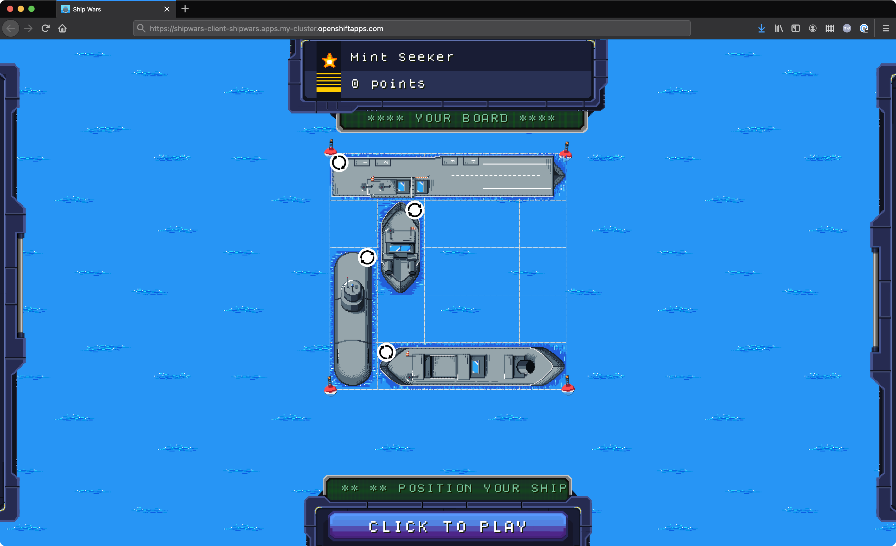

# Red Hat Arcade: Shipwars Deployment

This repository contains instructions and files to deploy the Shipwars game on
an OpenShift 4.x cluster, or via Docker Compose.

It also contains a useful Docker Compose to assist with local development setup.

<div align="center">
	<br>
    
	<br>
  <i>Shipwars running in a web browser.</i>
</div>

## OpenShift

Deploys the game into a project named "shipwars". Requires an OpenShift 4.x cluster.

```bash
# Login to your cluster using a token, or username and password
oc login

# Run the deploy script
cd openshift/
./deploy

# Print the route to the game UI
oc get route shipwars-client -n shipwars -o jsonpath='{.spec.host}'
```

The last command provides a route that you can visit in your browser to play
the game.

## Docker Compose

Git clone all of the Shipwars repos into the same folder. The result should
look like this:

```
workspace/
├── shipwars-bots/
├── shipwars-client/
├── shipwars-deployment/
├── shipwars-game-server/
└── shipwars-move-server/
```

Run the following commands to start the containers:

```bash
# Change into the directory with the local dev docker-compose file
cd shipwars-deployment/docker/

# Start the containers. This can take a minute
docker-compose up --force-recreate --remove-orphans
```

Once the containers have started the game will become available at
http://localhost:8484.

## Docker Local Development Mode

_NOTE: Only the Node.js containers support local development with live reload at present. Other images will need to be built and pushed to see changes reflected._

Clone the repositories as instructed

To start the local development containers run the following commands:

```bash
# Change into the directory with the local dev docker-compose file
cd shipwars-deployment/docker-local-dev/

# Start the containers. This can take a minute or two since dependencies
# are installed for the game server and bots server
docker-compose up --force-recreate --remove-orphans
```

Once the containers have started the game will become available at
http://localhost:8484. You can edit the `bots` and `game-server` TypeScript
files and the code in those containers will recompile in real-time.
