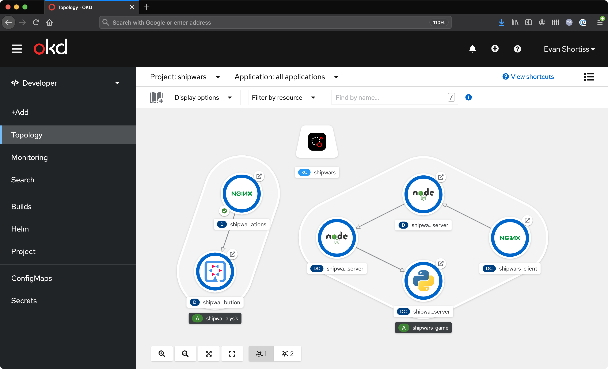

# Red Hat Arcade: Shipwars Deployment

This repository contains instructions and files to deploy the Shipwars game on
an OpenShift 4.x cluster, or via Docker Compose.

It also contains a useful Docker Compose to assist with local development setup.

<div align="center">
	<br>
    
	<br>
  <i>Shipwars running in a web browser.</i>
</div>

## Using with OpenShift Streams for Apache Kafka

_NOTE: This is optional and not required to run the core game services._

If you'd like to experiment with the Kafka and Kafka Streams portitions of this
application you'll need a [cloud.redhat.com](https://cloud.redhat.com) account - it's free!

You'll also need the [RHOAS CLI](https://github.com/redhat-developer/app-services-guides/tree/main/rhoas-cli)
installed in your development environment.

Once you have an account and the CLI installed, run the following commands from
the root of this repository. This configures a Kafka instance on cloud.redhat.com:

```bash
# Login using the browser based flow
rhoas login

# Create a kafka cluster named "shipwars"
rhoas kafka create shipwars

# Create the topics required by the applications
./configure-rhosak.sh
```

## Deployment on OpenShift

### Core Game Services

Requirements:

* OpenShift 4.x cluster or [OpenShift Sandbox](https://developers.redhat.com/developer-sandbox).
* OpenShift CLI (`oc`) 4.x.
* Account with permission to create a project and deploy resources into it.

```bash
# Login to your cluster using a token, or username and password
oc login

# Run the deploy script
cd openshift/

# Set the target namespace (created if it doesn't exist) and deploy into it.
# This deploys the primary game components, without Kafka integrations
./deploy.game.sh

# Print the route to the game UI that you can access in your we browser
oc get route shipwars-client -n shipwars -o jsonpath='{.spec.host}'
```

Notes on the default configuration:

* Deploys the game services into a project named "shipwars".
* Requests 500 millicores and 768MB memory from the cluster.
* Supports *at least* 100 conncurrent players.

The deployment creates a topology similar to the following screenshot:


<div align="center">
	<br>
    
	<br>
  <i>Shipwars OpenShift Topology.</i>
</div>

### Kafka Services and Integration

Follow the "Using with OpenShift Streams for Apache Kafka" section, then run
the following script:

```bash
./openshift/deploy.kafka.sh
```

This will:

* Create the following resources to link your OpenShift Streams instance with the project:
    * *KafkaConnection* CR.
    * *rh-cloud-services-accesstoken-cli* Secret.
    * *rh-cloud-services-service-account* Secret.
* Mount OpenShift Streams Kafka connection details to *shipwars-game-server* Deployment.
* Deploy a Quarkus Kafka Streams application to process player attacks.
* Build and deploy an NGINX container with a UI to visualise the player attacks.


<div align="center">
	<br>
    
	<br>
  <i>Shipwars OpenShift Topology with OpenShift Streams.</i>
</div>

## Docker Compose

Run the following commands from the root of this repository to start the
pre-built containers that are hosted on quay.io:

```bash
# Change into the directory with the local dev docker-compose file
cd shipwars-deployment/docker/

# Define OpenShift Streams connection details and start the containers. You must
# have completed the "Using with OpenShift Streams for Apache Kafka" section of
# this README first. Use "rhoas serviceaccount create" or the UI at
# cloud.redhat.com/beta/application-services/streams to obtain user/pass
KAFKACONNECTION_BOOTSTRAPSERVERS=$(rhoas kafka describe | jq .bootstrapServerHost -r) \
KAFKACONNECTION_SSL=true \
KAFKACONNECTION_USER=replace_with_sasl_client_id \
KAFKACONNECTION_PASSWORD=replace_with_sasl_client_secret \
docker-compose up
```

Once the containers have started the game will become available at
http://localhost:8484/.

## Docker/Podman Local Development Mode

_NOTE: Only the Node.js containers support local development with live reload at present. Other images will need to be built and pushed to see changes reflected._

Clone the repositories from [redhat-gamedev](https://github.com/redhat-gamedev) in the structure outlined below:

```bash
workspace/
├── shipwars-bots/
├── shipwars-client/
├── shipwars-deployment/
├── shipwars-streams/
├── shipwars-game-server/
└── shipwars-move-server/
```

### Docker Compose

```bash
# Change into the directory with the local dev docker-compose file
cd shipwars-deployment/docker-local-dev/

# Define OpenShift Streams connection details and start the containers. You must
# have completed the "Using with OpenShift Streams for Apache Kafka" section of
# this README first. Use "rhoas serviceaccount create" or the UI at
# cloud.redhat.com/beta/application-services/streams to obtain user/pass
KAFKACONNECTION_BOOTSTRAPSERVERS=$(rhoas kafka describe | jq .bootstrapServerHost -r) \
KAFKACONNECTION_SSL=true \
KAFKACONNECTION_USER=replace_with_sasl_client_id \
KAFKACONNECTION_PASSWORD=replace_with_sasl_client_secret \
docker-compose up --build --force-recreate
```
